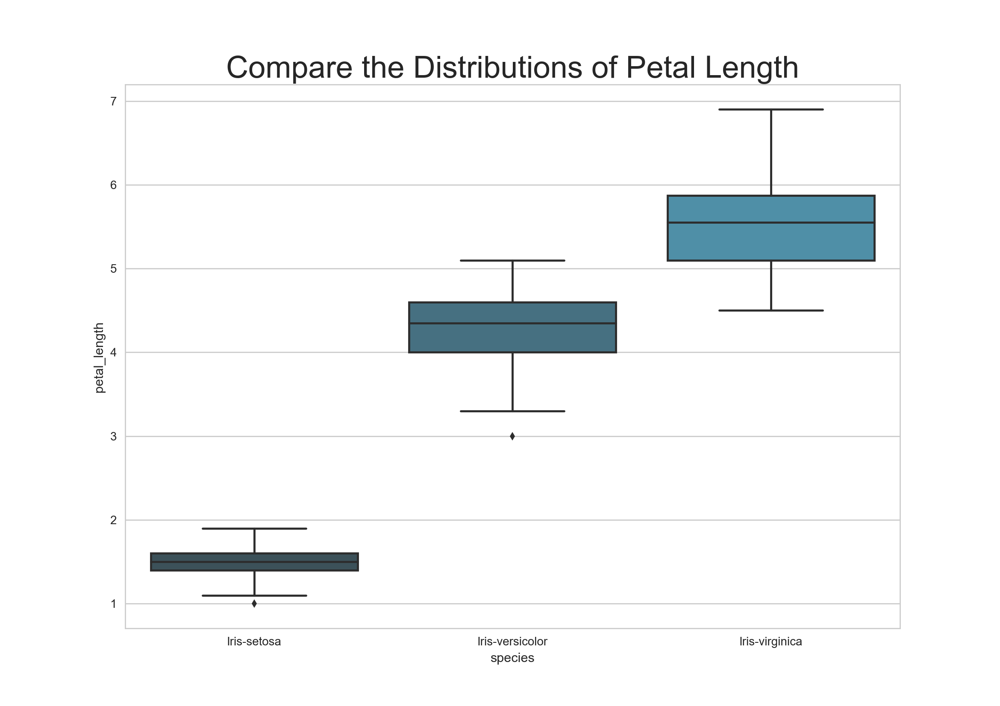
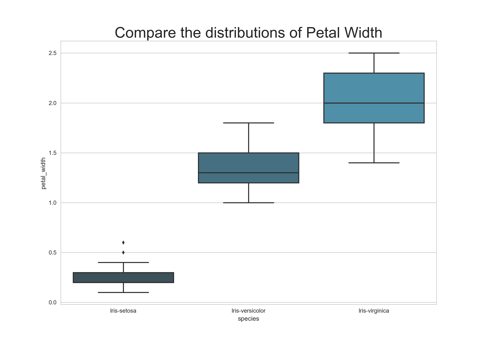
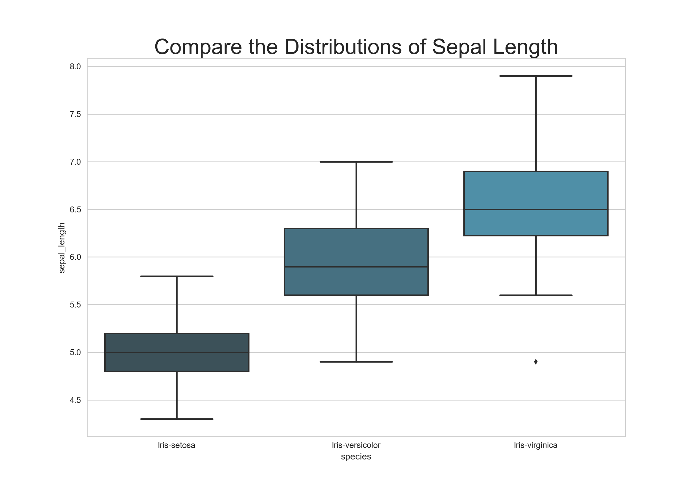
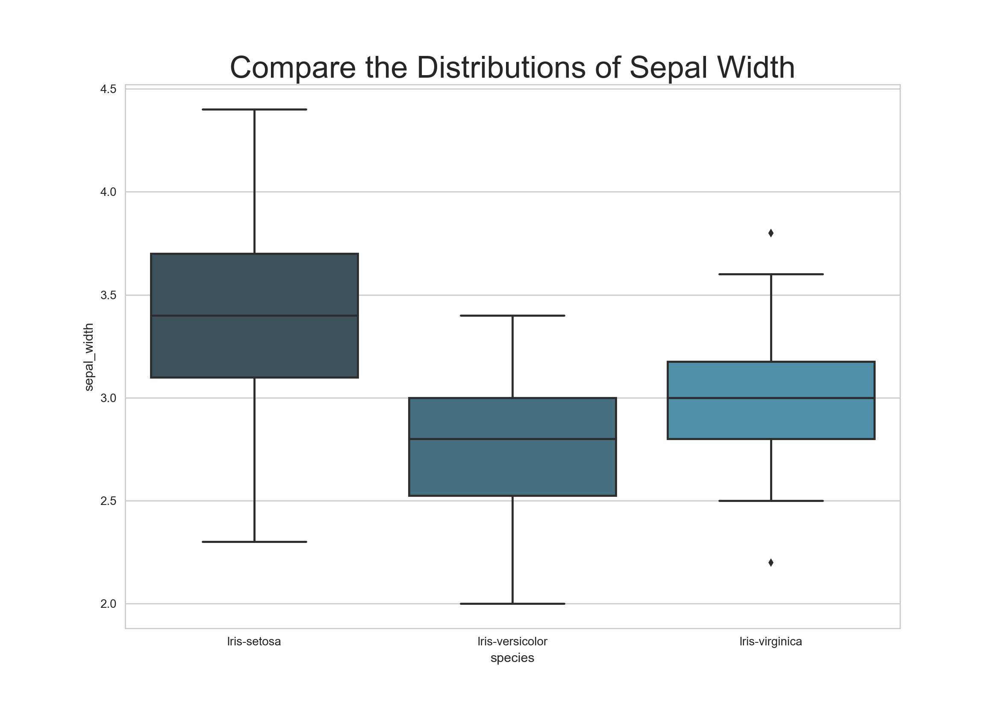

# Project2018-iris

The Iris flower data set or Fisher's Iris data set is a multivariate data set introduced by the British statistician and biologist Ronald Fisher in his 1936 paper "The use of multiple measurements in taxonomic problems" as an example of linear discriminant analysis.
This famous iris data set gives the measurements in centimeters of the variables sepal length and width and petal length and width, respectively, for 50 flowers from each of 3 species of iris. The species are Iris setosa, versicolor, and virginica.
 
The dataset contains a set of 150 records under 5 attributes -

1. sepal length in cm 
2. sepal width in cm 
3. petal length in cm 
4. petal width in cm 
5. Species: 
-- Iris Setosa 
-- Iris Versicolour 
-- Iris Virginica

## Libraries Used
Importing the libaries for this project: Pandas, Numpy, Holoviews.

Pandas is an open source, BSD-licensed library providing high-performance, easy-to-use data structures and data analysis tools.

NumPy is the fundamental package for scientific computing with Python

HoloViews is an open-source Python library designed to make data analysis and visualization seamless and simple.

Seaborn is a Python visualization library based on matplotlib. It provides a high-level interface for drawing attractive statistical graphics.

I also used the Jupyter Notebook for this project. 

## Data Import
Import the iris.csv using the panda library and examine first few rows of data

## Discovering the Shape of the table
Find out what the size of rows and columns in the table

## Find out unique classification/type of iris flower and the amount
'Iris-setosa', 'Iris-versicolor', 'Iris-virginica'

## Investigating the data
Min, Max, Mean, Median and Standard Deviation

## Summary Statistics Table
This statistics table is a much nicer, cleaner way to present the data. We can see there is huge range in the size of the Sepal Length and Petal Length. We will use box plots and scatter plots to see if the size is related to the species of Iris.

## Boxplots
The boxplot is a quick way of visually summarizing one or more groups of numerical data through their quartiles. Comparing the distributions of:

- Sepal Length
- Sepal Width
- Petal Length
- Petal Width

From the Boxplot, we can see that there are distinct differences between the Petal Length, Petal Width and Sepal Length across the Species. 

## Scatterplots
Here we can use to variables to show that there is distinct difference in sizes between the species. Firstly, we look at the Petal width and Petal length across the species. Is it clear to see that the iris Setosa has a significantly smaller petal width and petal length than the other two species. This difference occurs again for the Petal width and Sepal length. And in both cases we can see that the Iris Viginica is the largest species.

## Pairplot
This chart enables us to quickly see the relationships between variables across multiple dimensions usings scatterplots and histograms.
